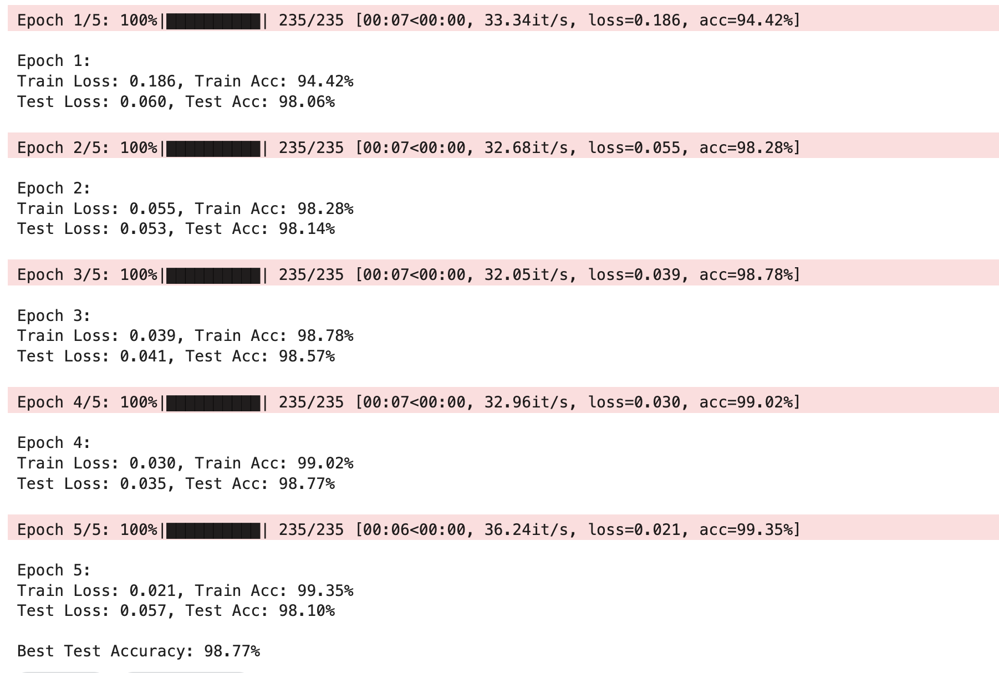
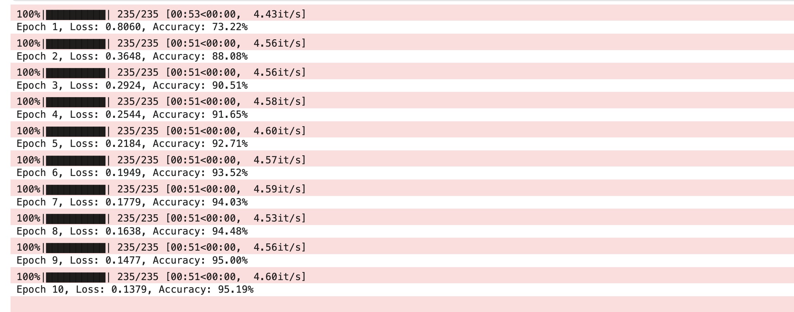
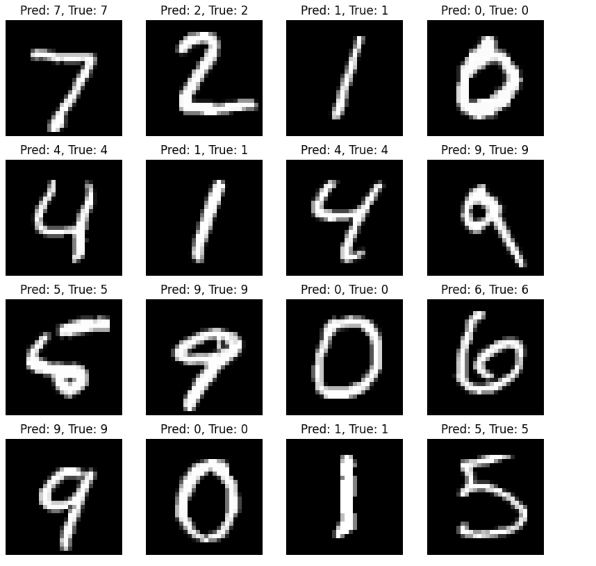
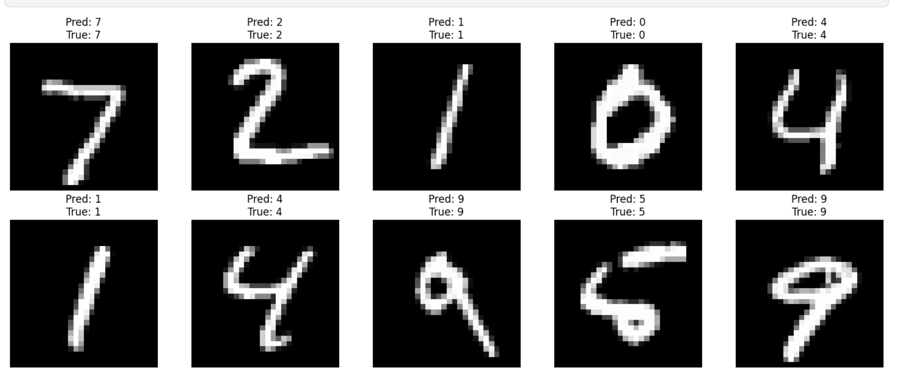

# MNIST Classification Models using Custom Pytorch Layers

This repository contains two different approaches to MNIST digit classification, both implementing custom PyTorch layers from scratch. The models demonstrate how to build neural network components from the ground up while achieving competitive performance on the MNIST dataset.

## Models Overview

### 1. Custom CNN Model
The CNN-based approach (`mnist_cnn.py`) implements a traditional convolutional neural network with all layers built from scratch. This model demonstrates how standard CNN components work under the hood.

#### Architecture Details:
- **Input Processing**: Standard 28×28 image input
- **Custom Components**:
  - `CustomConv2d`: Custom 2D convolution layer
  - `CustomBatchNorm2d`: Custom batch normalization
  - `CustomMaxPool2d`: Custom max pooling
  - `CustomLinear`: Custom fully connected layer

#### Key Features:
- Kaiming/He initialization for weights
- Proper gradient flow management
- Batch normalization with running statistics
- Max pooling for spatial dimension reduction


### 2. Custom Transformer Model
The transformer-based approach (`mnist_transformer.py`) implements a vision transformer that processes MNIST images as sequences of pixels. This model showcases how transformer architectures can be applied to computer vision tasks.

#### Architecture Details:
- **Input Processing**: 28×28 images are processed as sequences
- **Custom Components**:
  - `CustomLinear`: Implementation of linear transformations
  - `MultiHeadSelfAttention`: Custom attention mechanism with multiple heads
  - `CustomLayerNorm`: Layer normalization implementation
  - `CustomReLU`: Custom activation function
  - `CustomFeedForward`: Position-wise feed-forward network
  - `TransformerEncoderLayer`: Complete transformer encoder block
  - `CustomMeanPooling`: Global pooling operation

#### Key Features:
- Multi-head self-attention mechanism
- Position-wise feed-forward networks
- Layer normalization
- Residual connections
- Mean pooling for final classification

## Implementation Details

### Custom Layer Implementations

#### CNN Model Custom Layers:
1. **CustomConv2d**:
   ```python
   fan_in = in_channels * kernel_size * kernel_size
   bound = math.sqrt(2.0 / fan_in)
   self.weights = nn.Parameter(torch.randn(...) * bound)
   ```

2. **CustomBatchNorm2d**:
   - Tracks running mean and variance
   - Implements batch statistics during training
   - Uses running statistics during inference

3. **CustomMaxPool2d**:
   - Implements spatial downsampling
   - Maintains translation invariance
   - Reduces computational complexity


#### Transformer Model Custom Layers:
1. **CustomLinear**:
   - Implements `y = xW + b`
   - Includes proper weight initialization
   - Handles both 2D and 3D inputs

2. **MultiHeadSelfAttention**:
   ```python
   Q = self.query_weights(x)
   K = self.key_weights(x)
   V = self.value_weights(x)
   scores = Q @ K.transpose(-2, -1) / (self.head_dim ** 0.5)
   attention_weights = F.softmax(scores, dim=-1)
   ```

3. **CustomLayerNorm**:
   - Implements `γ(x-μ)/√(σ²+ε) + β`
   - Maintains running statistics
   - Handles both training and inference modes

## Training Process

Both models use:
- Adam optimizer with learning rate 0.001
- Cross-entropy loss function
- Batch size of 128/256
- MNIST dataset with standard normalization

### Training Logs

#### CNN Model

Link to Cloud run: https://www.kaggle.com/code/faizal0337/cnn-model-using-custom-layers-pytorch-for-mnist

Logs:



#### Transformer Model

Link to Cloud run: https://www.kaggle.com/code/faizal0337/transformer-using-custom-layers-pytorch-for-mnist

Logs:



## Usage

1. Install requirements:
   ```bash
   pip install torch torchvision tqdm matplotlib
   ```

2. Run CNN model:
   ```bash
   python CNN/mnist_cnn.py
   ```

3.  Run Transformer model:
   ```bash
   python Transformers/mnist_transformer.py
   ```

## Results Visualization

- CNN: 



- Transformer: 



## Thank You
